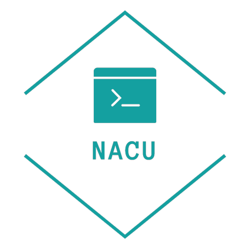
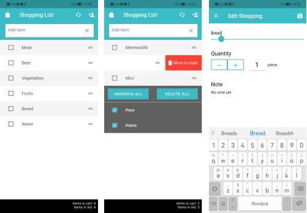

<h1 id="mobi-lab-shopping-list-app">Mobi Lab Shopping List App</h1>
<h3 id="features">Features</h3>
<ul>
<li>Firebase implementation.</li>
<li>Add items to a list. </li>
<li>Delete items with dismissible swipe gestures.</li>
<li>Check and uncheck items within a list.</li>
<li>Uncheck all items already checked.</li>
<li>Delete all items already checked.</li>
<li>Edit items, for now, the title and quantity.</li>
</ul>
<h3 id="getting-started-🚀">Getting Started 🚀</h3>

This project contains 3 flavors:

<ul>
<li>Development</li>
<li>Staging</li>
<li>Production</li>
</ul>

To run the desired flavor either use the launch configuration in VSCode/Android Studio or use the following commands:

<pre class="codeblock language-sh"># Development
$ flutter run --flavor development --target lib/main_development.dart

# Staging
$ flutter run --flavor staging --target lib/main_staging.dart

# Production
$ flutter run --flavor production --target lib/main_production.dart
</pre>

<em>*Mobi Lab Shopping List App works on iOS, Android, Web, and Windows.</em>

<h3 id="build-with">Build with</h3>

  

<h3 id="screenshots">Screenshots</h3>

